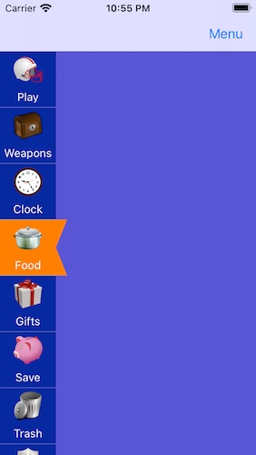
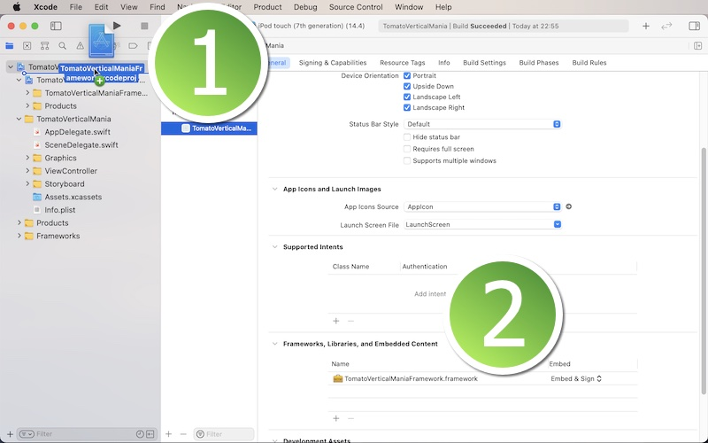
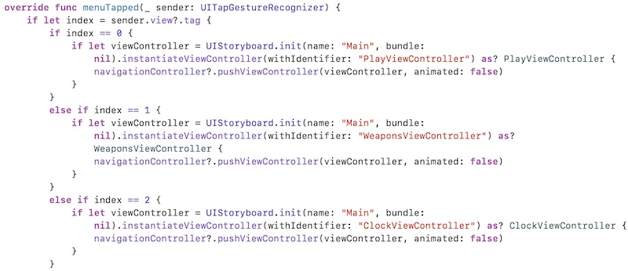

# TomatoVerticalMenuMania Framework

<h2>Development and compatibility</h2>

Development platform: iOS 
Language: Swift 
UI framework: UIKit 
Compatibility: iOS 13 or greater 

<h2>Description</h2>

TomatoVerticalMenuMania lets you create a vertical, scrollable menu to the left of the screen.  Each button corresponds to a specific view controller.  You can hide and show the navigation item button with or without animation, which is up to you.  The following is a list of features.

<ol>
<li>List a number of buttons, each of which corresponds to a specific view controller.</li>
<li>Use an image to characterize a corresponding view controller.</li>
<li>Let the user scroll up and down on the menu to select a button.</li>
<li>Show a pentagon or square marker to indicate which sub-menu has currently been selected.</li>
<li>Customize the color of the selection marker.</li>
</ol>

<h2>Installation</h2>

1. In order to use this framework, download the sample project.  You will find the folder titled **TomatoVerticalManiaFramework**.  Locate the Xcode file inside.  And put this Xcode file in your Xcode project.  Select your target and make sure you have **TomatoVerticalManiaFramework.framework** under General > Framworks, Libraries, and Embeded Content as shown below.

2. Create a sub-class of **UIViewController**.  Name it BasicViewController, BaseViewController, RootViewController or whatever you want such that all child view controllers can be based on.  For now, let us call this base view controller **BasicViewController**.  Import **TomatoVerticalManiaFramework** to the view controller.

3. In the base view controller, set the class to **TomatoVerticalManiaViewController**.  Create a function to set up the menu.  Let us call this function **setup(index: Int)**.  Also create an **override** function named **menuTapped**.

4. In the setup function, create an array of menu models with **TomatoVerticalMenuModel**.  This struct takes three properties: menuName (String), menuIndex (Int), imageName (String).  The **menuName** property is the name of a tappable view (UIView) that appears on the vertical menu.  And each of them corresponds to a specific view controller through the menuTapped function.  The index property determines the order of appearance.  It also tells the app which view controller it should access.  Moreover, the **imageName*** property is the name of the image used to characterize each sub-menu.

5. Call **tomatoVerticalSetup(index: index)** in the setup(index: Int) function of the base view controller.

6. Use the menuTapped function to read sender view's tag to direct the app to a specific view controller.  The following is an example.

7. In each view controller to which the app is directed to, change the class to BasicViewController.  In its **viewDidLoad** method, call setup(index: number), where 'number' is an Int type value of a menu model from No. 4.

<h2>Variables</h2>

<li>verticalBackColor: It's the background color of the entire vertical menu.</li>
<li>menuWidth: It's the width of each sub-menu.</li>
<li>menuHeight: It's the height of each sub-menu.</li>
<li>imageSide: It's the width and the height of an image characterizing each sub-menu.</li>
<li>hasInset: Set it true to have a pentagon-shaped marker.  Set it to false to have a square-shaped marker.</li>
<li>insetColor: It's the color of the marker indicating which menu has been currently seleced.</li>
<li>insetSize: It determines the inset size of the marker.</li>
<li>nameLabelFontSize: It determines the font size of the label name of each sub-menu.</li>
<li>nameLabelHeight: It determines the height of the label of each sub-menu.</li>
<li>nameLabelFromBottom: It determines how far the name label goes away from the bottom of each sub-menu.</li>
<li>labelTextColor: It's the text color of the name label.</li>
<li>labelBackColor: It's the background color of the name label.</li>
<li>showVerticalScroll: By default, it's set to false.  And the vertical scroller doesn't appear.  Or set it to true.</li>
